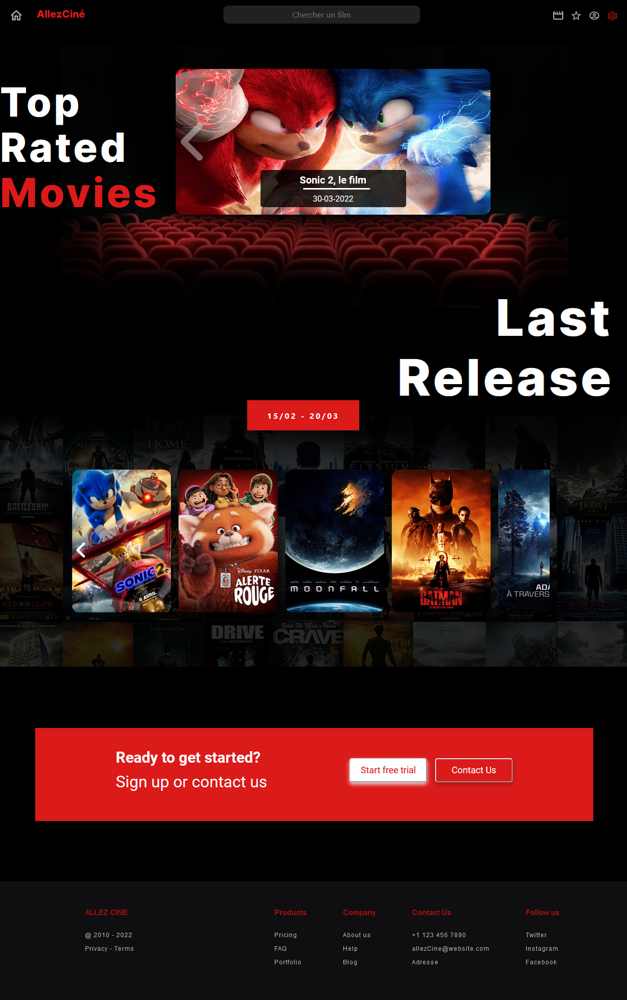

# AllezCine

# But du projet 

Le but de ce projet est de réaliser un site sur lequel des films sont proposés. La liste de ces films proviennent directement d'une API.

Ce projet de groupe, d'une durée de 5 jours, est réalisé en collaboration avec [@Amoryne](https://github.com/Amoryne), [@Elena](https://github.com/TozurElena) et [@Nicolas](https://github.com/Kurner)

# Technologies mises en place

Afin de mener à bien ce projet, différentes technologies ont été utilisées. 

* Utilisation d'un design via une planche [Figma](https://www.figma.com/file/sDT58wuez4oWbfw6rEN8Yp/Untitled)

* Consolidation des technologies front-end, à savoir HTML5 et SASS

* Utilisation de framework CSS. Dans notre cas, Bootstrap a été choisi

* Utilisation de JavaScript dans un cas concret avec la manipulation du DOM ainsi que manipuler une API en utilisant l'asynchrone

# Lien du site

[AllezCine](https://calcagnoloic.github.io/AllezCine/)

